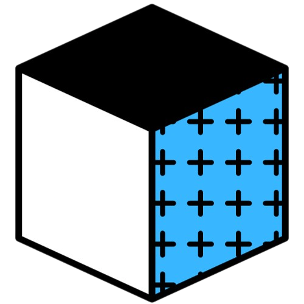
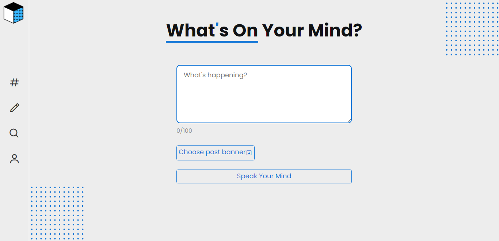
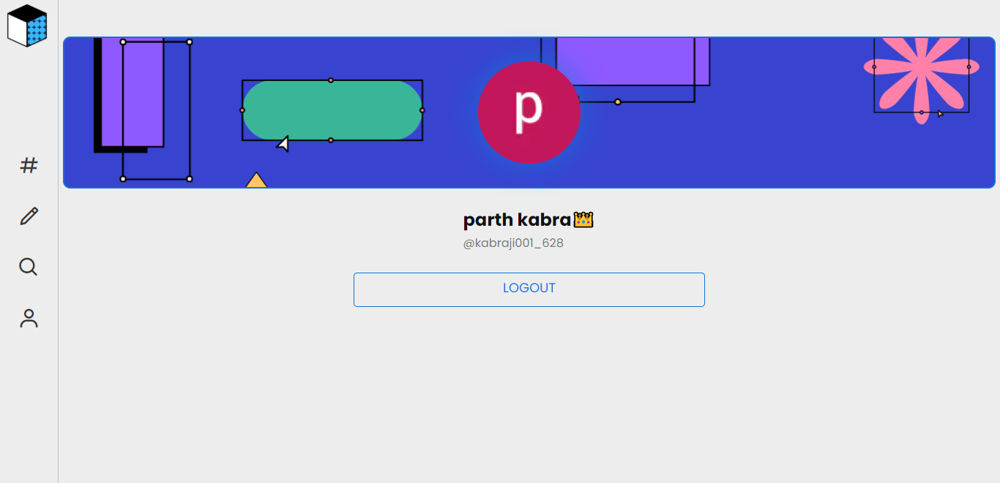

# VibeShare: A Social Media App

  

VibeShare is a social media app that allows users to share and discover vibes with a Next.js frontend, Flask backend, and Firebase authentication.

## Features

- User authentication with Firebase
- Create and share vibes with the community
- Next.js for a fast and dynamic frontend
- Flask backend for handling data and business logic

## Technologies Used

- [Next.js](https://nextjs.org/)
- [Flask](https://flask.palletsprojects.com/)
- [Firebase Authentication](https://firebase.google.com/docs/auth)

## Backend Repository

The backend of VibeShare is implemented using Flask for handling data and business logic. You can find the source code in the following repository:

[Backend Repository](https://github.com/parth-kabra/vibeshare-backend)

## Screenshots

### Homepage

### Vibe Creation

### User Profile

